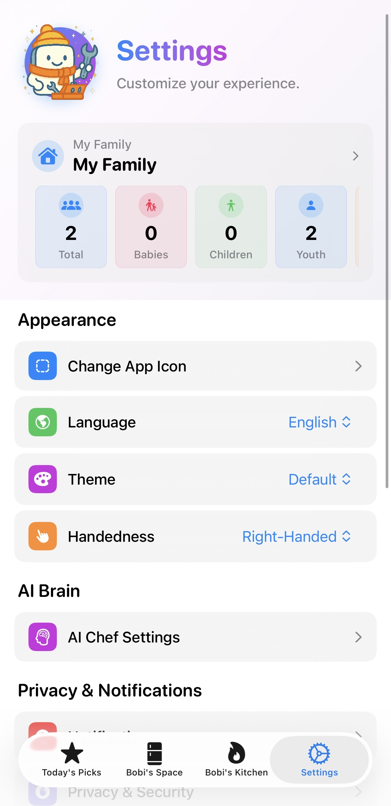

# Bobi: AI-Powered Smart Food Inventory & Meal Planning App

[中文](./README.zh-CN.md) | **English**

[](https://swift.org)
[](https://developer.apple.com/ios/)
[](https://developer.apple.com/xcode/swiftui/)
[](https://www.openai.com/)

> **Redefining home food management with advanced AI - from shopping to cooking.**

## 🎨 About Bobi

**Bobi** is an open-source project exploring the potential of AI in daily life. Built with a "vibe coding" philosophy, it combines rapid prototyping with user-centric design to solve the "what to eat" dilemma. We focus on:
- **Fast prototyping** with AI-assisted development
- **User-centric design** driven by real pain points
- **Privacy-first** design with 100% local data storage (no cloud servers)

---

## 📱 App Interface Showcase

### 🏠 Home & Daily Suggestions
| Home | Daily Recommendation | Nutrition & Recipe |
|:---:|:---:|:---:|
|  |  |  |
| Main View Overview | Recommends dishes based on weather, time, and mood.<br>Add ingredients to shopping list with one tap. | Displays nutrition facts and detailed<br>cooking steps for the recommendation. |

### 📦 Smart Inventory & Input
| Inventory (Category) | Inventory (Location) | Voice Input |
|:---:|:---:|:---:|
|  |  |  |
| Pantry inventory by category.<br>Provides shelf life suggestions and alerts. | Pantry inventory by storage location.<br>Intuitively manage fridge and cabinets. | Voice input page.<br>Supports natural language for quick entry. |

### 🛒 Shopping & Cooking
| Shopping List | Scenario Recommendations | Recipe Generation |
|:---:|:---:|:---:|
|  |  |  |
| Manage staples. Thresholds link to inventory;<br>alerts when stock is low. | Recommendations for scenarios (e.g., quick meals)<br>and family needs (allergies, diets). | Generated recipe details.<br>Ingredients removed from inventory upon cooking. |

### ⚙️ Settings
| Settings | | |
|:---:|:---:|:---:|
|  | | |
| Personalization and preferences management | | |

---

## ✨ Core Features

- 🎤 **Smart Voice Input**: Natural language processing for instant ingredient recording (e.g., "Bought 3 apples and milk").
- 📸 **OCR Smart Scanning**: One-tap scanning to batch import shopping lists from receipts.
- 🤖 **AI Recipe Recommendations**: Personalized suggestions based on weather, mood, and available ingredients.
- 🛡️ **Safety First**: Intelligent filtering for allergens and dietary restrictions (including strict baby-safe logic).
- 📦 **Smart Inventory**: Expiration tracking, categorization, and storage location management.
- 🔄 **Shopping Loop**: Auto-generated shopping lists based on missing recipe ingredients or stock thresholds.
- 🔧 **Multi-Model Support**: Compatible with OpenAI, Anthropic, Google Gemini, and DeepSeek.

---

## 🚀 Getting Started

### System Requirements
- **Xcode**: 26.0+ (Recommended)
- **iOS**: 18.5+ (Minimum), 26.0+ (Recommended for Liquid Glass effects)

### API Key Configuration

Bobi supports two ways to configure AI service API keys:

#### Option 1: In-App Configuration (Recommended)
- Open the app and navigate to **Settings**
- Enter your API keys for your preferred AI services
- Supports: OpenAI, Anthropic Claude, Google Gemini, DeepSeek

#### Option 2: Built-in API Key
If you want to build the app with a pre-configured API key:
1. Locate the file: `Bobi/GenAI.plist`
2. Replace `YOUR_GEMINI_API_KEY_HERE` with your actual Gemini API key
3. Build and run the app

**Note:** For security reasons, never commit your actual API keys to version control. Add `GenAI.plist` to `.gitignore` if it contains real keys.

---

## 🏗️ Technical Architecture

### Tech Stack
- **Frontend**: SwiftUI + SwiftData + Swift Concurrency
- **AI**: OpenAI/Anthropic/Google/DeepSeek APIs
- **Services**: Apple WeatherKit, Speech Framework, Vision Framework (OCR)
- **Data**: 100% Local Storage (SwiftData), no cloud database.

### Hybrid Processing Architecture
```
┌─────────────────────┐    ┌──────────────────────┐
│   On-Device         │    │   LLM API Service    │
│ (Local & Private)   │    │ (Stateless Compute)  │
├─────────────────────┤    ├──────────────────────┤
│ • iOS Speech API    │    │ • Multi-Model AI     │
│ • SwiftData DB      │    │ • Recipe Generation  │
│ • Text Processing   │    │ • Nutrition Analysis │
└─────────────────────┘    └──────────────────────┘
```

---

## 🛡️ AI Safety & Privacy

Bobi prioritizes user safety with a multi-layer verification system:
- **Health Guardrails**: Filters out non-food items and dangerous combinations.
- **Dietary Protection**: Strict adherence to allergen settings and age-appropriate recommendations (e.g., specific logic for infants).
- **Data Privacy**: All user data (inventory, preferences, history) is stored locally on the device. The only network traffic is for LLM API inference.

---

## 📜 License & Attribution

This project is open-sourced under the MIT License.

✅ **You are encouraged to:**
- Fork and modify for personal or commercial use
- Learn from the codebase
- Contribute improvements back to the community

⚠️ **Attribution is required** - Please credit the original Bobi project and author.
