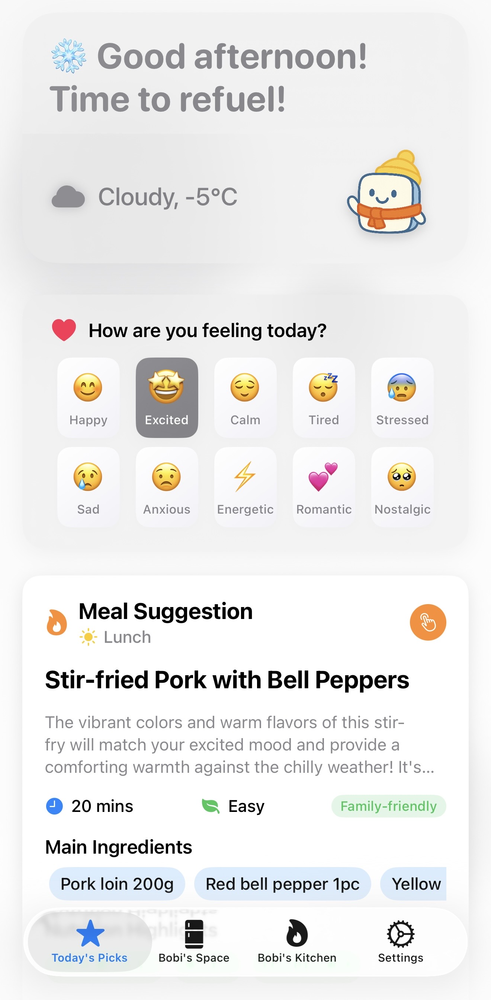
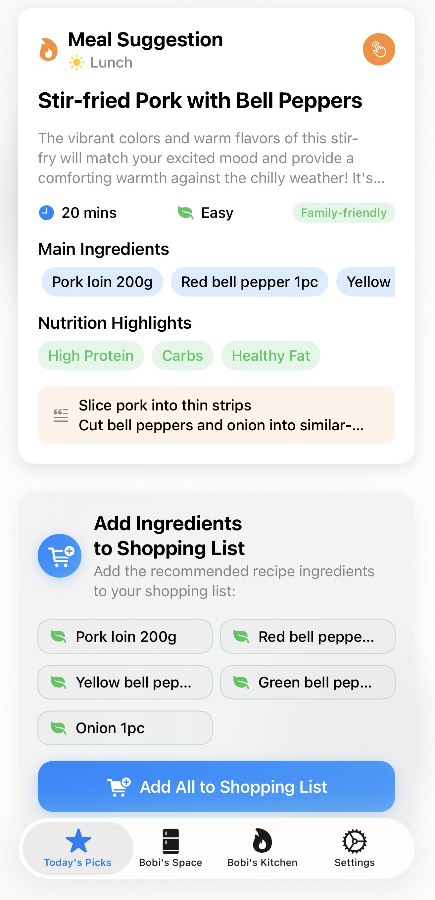
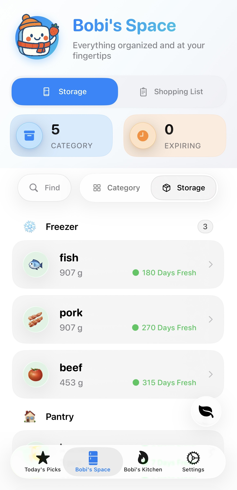
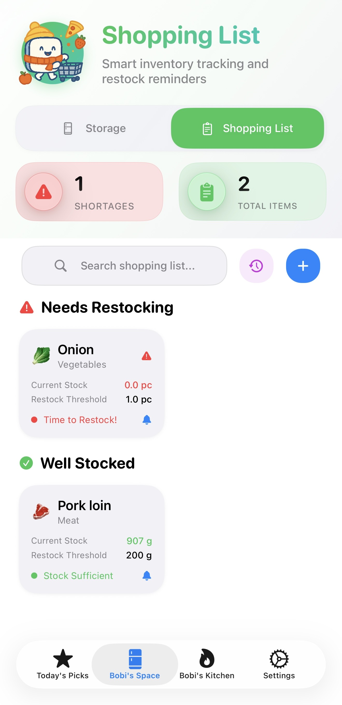
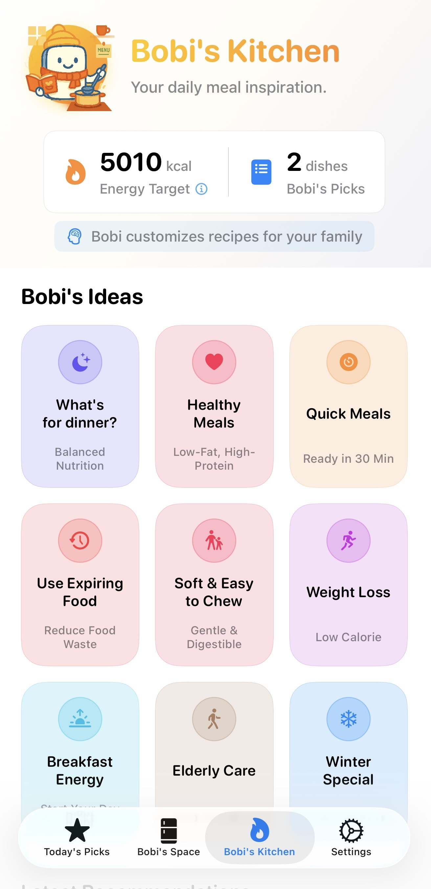
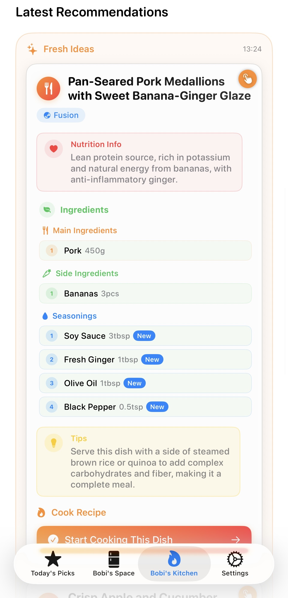

# Bobi: 智能食材管理与AI膳食规划应用

**中文** | [English](./README.md)

[](https://swift.org)
[](https://developer.apple.com/ios/)
[](https://developer.apple.com/xcode/swiftui/)
[](https://www.openai.com/)

> **通过先进的AI技术重新定义家庭食材管理 - 构建从购物到烹饪的智能闭环。**

## 🎨 关于 Bobi

**Bobi** 是一个探索AI在日常生活潜力的开源项目。基于 "vibe coding" 理念构建，它结合了快速原型开发与以用户为中心的设计，旨在解决“今天吃什么”的终极难题。我们关注：
- **快速迭代** 的AI辅助开发模式
- **以人为本** 的真实痛点解决方案
- **隐私优先** 设计，所有数据完全本地存储（无云端服务器）

---

## 📱 界面展示

### 🏠 首页与每日推荐
| 主页 | 每日推荐 | 营养与做法 |
|:---:|:---:|:---:|
|  |  |  |
| 主页概览 | 针对当前天气、时间和用户心情推荐菜品。<br>可一键添加食材到购物清单。 | 展示当日推荐菜品所包含的营养成分<br>及详细制作步骤。 |

### 📦 智能库存与录入
| 库存（种类视图） | 库存（位置视图） | 语音输入 |
|:---:|:---:|:---:|
|  |  |  |
| 家庭食材库（种类分类）。<br>自动给出保存时间建议，即将过期时提示。 | 家庭食材库（存储空间分类）。<br>直观管理冰箱与储物柜各个角落。 | 智能语音输入页面。<br>支持自然语言快速录入食材信息。 |

### 🛒 购物与烹饪
| 购物清单 | 场景化推荐 | 菜品生成 |
|:---:|:---:|:---:|
|  |  |  |
| 保存常备食材。阈值与库存联动，<br>低于阈值自动提示。 | 针对不同场景（如减脂、快手餐）<br>及家庭情况（过敏、忌口）推荐。 | 生成的菜品详情。<br>选择制作后自动扣除库存食材。 |

---

## ✨ 核心特色

- 🎤 **智能语音录入**: 支持自然语言输入（如"买了三个苹果和一瓶牛奶"），一秒完成录入。
- 📸 **OCR 智能扫描**: 一拍即录，自动识别购物小票并批量导入食材。
- 🤖 **AI 智能食谱**: 结合天气、心情和现有食材，提供个性化的烹饪建议。
- 🛡️ **安全第一**: 严格的过敏原过滤和分龄饮食建议（包含婴儿专属逻辑）。
- 📦 **智能库存管理**: 自动分类、预测保质期，并支持多位置管理。
- 🔄 **智能闭环**: 缺货自动加入购物单，做完菜自动扣减库存。
- 🔧 **多模型支持**: 支持 OpenAI、Anthropic、Google Gemini 和 DeepSeek 等主流模型。

---

## 🚀 快速开始

### 系统要求
- **Xcode**: 26.0+ (推荐)
- **iOS**: 18.5+ (最低), 26.0+ (推荐，以获得 Liquid Glass 液态玻璃效果)

### API Key 配置

Bobi 支持两种方式配置 AI 服务的 API 密钥：

#### 方式一：应用内配置（推荐）
- 打开应用，进入**设置**页面
- 输入你偏好的 AI 服务的 API 密钥
- 支持：OpenAI、Anthropic Claude、Google Gemini、DeepSeek

#### 方式二：内置 API Key
如果你想在构建应用时预配置 API 密钥：
1. 找到文件：`Bobi/GenAI.plist`
2. 将 `YOUR_GEMINI_API_KEY_HERE` 替换为你的实际 Gemini API 密钥
3. 构建并运行应用

**注意：** 出于安全考虑，永远不要将实际的 API 密钥提交到版本控制系统。如果 `GenAI.plist` 包含真实密钥，请将其添加到 `.gitignore`。

---

## 🏗️ 技术架构

### 技术栈
- **前端**: SwiftUI + SwiftData + Swift Concurrency
- **AI**: OpenAI/Anthropic/Google/DeepSeek APIs
- **服务**: Apple WeatherKit, Speech Framework, Vision Framework (OCR)
- **数据**: 100% 本地存储 (SwiftData)，无云端数据库。

### 混合处理架构
```
┌─────────────────────┐    ┌──────────────────────┐
│    设备端处理        │    │    大模型 API 服务    │
│  (本地 & 隐私)       │    │   (无状态计算)        │
├─────────────────────┤    ├──────────────────────┤
│ • iOS Speech API    │    │ • 多模型AI集成       │
│ • SwiftData 数据库   │    │ • 食谱智能生成       │
│ • 基础文本处理       │    │ • 营养分析算法       │
└─────────────────────┘    └──────────────────────┘
```

---

## 🛡️ AI 安全与隐私

Bobi 采用多层验证系统确保用户安全：
- **健康防护**: 自动过滤非食品物品和危险组合。
- **饮食保护**: 严格遵守过敏原设置和年龄适宜性建议（例如婴儿专属逻辑）。
- **数据隐私**: 所有用户数据（库存、偏好、历史）均保存在设备本地。唯一的网络请求仅用于大模型 API 推理。

---

## 📜 开源协议

本项目基于 MIT 协议开源。

✅ **我们鼓励你：**
- Fork 并修改用于个人或商业用途
- 学习代码库和架构设计
- 将改进贡献回社区

⚠️ **需要署名** - 请保留对原始 Bobi 项目和作者的署名。
